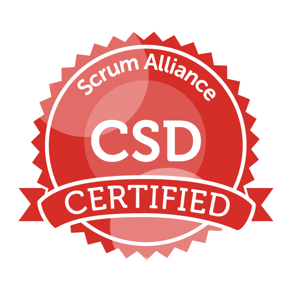

# Small Bio

Developing software is actually a long-term hobby of mine. My first contact with
computers date back to 1982, when I met an Apple II machine. At that time, I was
only 11. But only in 1986 I could get really interested in computers. My mother
registered me on a BASIC course. So, I learned BASIC on TRS-80 based machines:
Prologica CP-200 and Microdigital TK-85 and TK-90X. 

But, in 1991, after six months of electrical engineering course, I learned
Pascal as part of the course. At that time, electrical engineering died for me,
but computing was born. In 1994 I got my first job as a programmer: C
programmer. I wrote lots of C code, using Sybase embedded SQL. And from there, I
did not stop. 

I learned several programming languages: BASIC, Pascal, C, C++, Visual Basic,
Transact SQL, PL/SQL, TCL, TK, Python, Java, Javascript, Ruby, Python, Objective
C, Swift, Objective C++, Smalltalk, LISP, Bourne and C shell scripting,
Applescript, Lua, and the list keeps growing.

# Certifications

